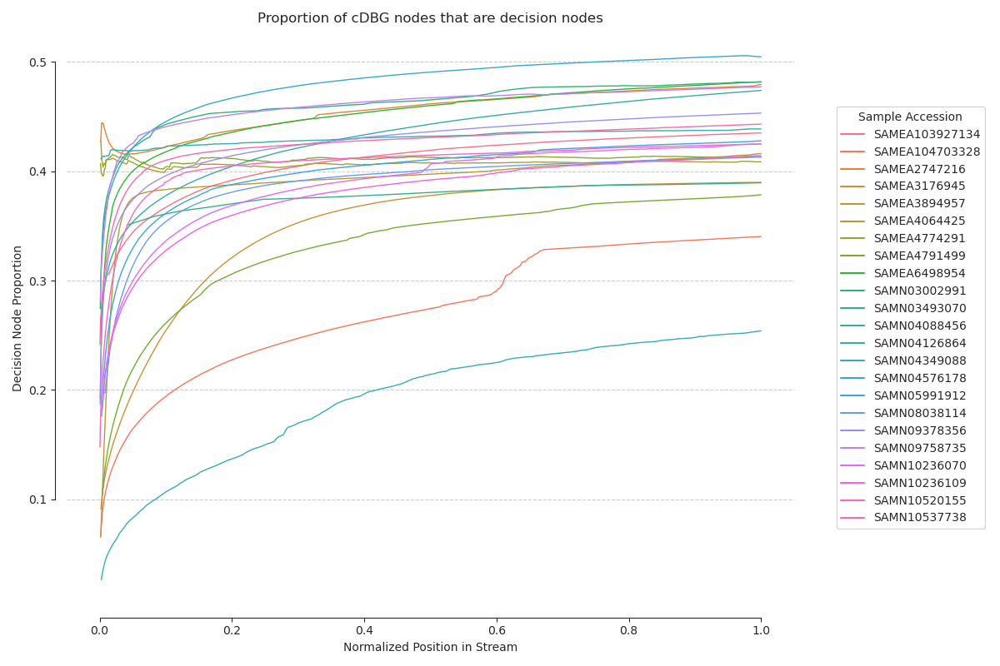
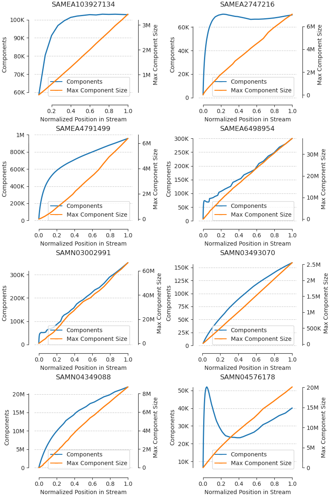

# Streaming Construction of the Compact de Bruijn Graph{#streaming-cdbg}

\chaptermark{Streaming cDBG Construction}

\begin{sizepar}{16}{24}
\begin{description}

\item[Chapter Authors]
Camille Scott and C. Titus Brown

\item[DOI]
\url{}

\end{description}
\end{sizepar}


## Abstract

Traditionally, approaches for sequence fragment analysis such as assembly have been off-line; assembly, in particular, has been a process in which all data is first loaded into memory (generally, a graph abstraction) before further processing to extract
contigs. As the volume of available data increases, and constantly updating data streams become ubiquitous, it is advantageous to consider
on-line, or streaming, approaches which view the data as a stream of observations which are used to update
an analysis or knowledge representation as they are integrated. Here, we present a streaming approach to construction of the
compact de Bruijn Graph, a common assembly graph abstraction. The procedure is described theoretically, and a reference implementation
is explored on several example data sets.

## Background

### Context

Developments in high-throughput sequencing technology have made genomics, transcriptomics, metagenomics, and their variants core methods for biological inquiry.
These sequencing technologies work by randomly sampling short fragments, or reads, from the underlying pool of DNA (or RNA) at a high redundancy,
after which computational methods are used to assemble an approximation of the original sequence.
While early methods directly computed overlaps between shallowly-sampled fragments [@roach_random_1995], deep sequencing has necessitated the development of more clever data structures and algorithms for assembly.
Assembly graphs are one such abstraction [@myers_toward_1995; @simpson_theory_2015; @chikhi2016compacting], and are used as an intermediate
representation in most extant assemblers; the de Bruijn graph [@myers_fragment_2005; @li_exploring_2012; @zerbino_velvet:_2008; @pevzner2001eulerian] is a core method for constructing assembly graphs.

In the de Bruijn graph methods, reads are broken down into substrings of length $k$, or $k$-mers, from which the unique representatives become the nodes in the graph. Edges are
defined when nodes have $k$-mers with exact overlaps of length $k-1$; this implicit definition of edges obviates the need for explicit overlap computation, making de Bruijn graphs well-suited to deep sequence experiments with short reads (see \@ref(chap1-background-definitions)).
While this property greatly improves the time scaling of the assembly problem, the de Bruijn graph suffers from extremely high storage requirements due to the explicit enumeration of $k$-mers.
To address this, it is often compacted by the contraction of linear paths of non-branching $k$-mers, forming the compact de Bruin graph [@movahedi2012novo].

A number of approaches for generating the compact de Bruijn Graph are already established. BCALM2 generates a compact de Bruijn Graph from short reads in parallel using ranked minimizers [@chikhi2016compacting], building on their previous work on de Bruijn graph representation and compaction [@chikhi2015representation].
TwoPaCo generates the cDBG from a collection of previously assembled genomes using a two-pass Bloom-filter approach to eliminate candidate decision (CTB: explain why you want to eliminate candidate decision k-mers?) $k$-mers [@doi:10.1093/bioinformatics/btw609].
Bifrost efficiently constructs the colored cDBG using blocked Bloom filters and and minimizer indexing [@doi:10.1186/s13059-020-02135-8], while Cuttlefish uses finite-state automata to efficiently model the colored cDBG [@doi:10.1093/bioinformatics/btab309].
Regardless of the method for generating the graph, extant approaches share a paradigm: they are off-line algorithms, algorithms which require access to the entire sample before proceeding with compaction, and make multiple passes over the data.
In contrast, streaming (or online) algorithms view their data as a sequence of observations, and make one or fewer passes over that stream [@mcgregor_graph_2014], while semi-streaming algorithms aim for a small, constant number of passes, generally two or fewer [@feigenbaum_graph_2005].
Streaming approaches have several advantages: they minimize hard disk access, which aids in efficiency; they are often able to produce results opportunistically, as soon as they are available; they offer the potential for feedback between the data stream and the processing; and often, they are suited for handling streams of infinite length.

Here, we explore an implementation of a streaming de Bruijn graph compactor. Our implementation builds the compact de Bruijn graph opportunistically from a stream of sequence fragments, in one pass over the data. While semi-streaming de Bruijn graph compactors have been previously published [@rozov2017faucet; @el2016lightassembler], our implementation produces a compact de Bruijn graph in one pass. 

### Definitions {#chap1-background-definitions}

For some string $s$, let $s[i]$ be the symbol at position $i$, $0$-indexed, and $s[i:j]$ be the substring of $s$ starting at position $i$ and not including position $j$. 
If $s$ has length $L$, the $k$-mers of $s$ are given by $\texttt{kmers}(s) = \{s[i:i+k] \mid 0 \le i < L-k+1 \}$ ; that is, all length $k$ substrings of $s$.
Let $\texttt{pre}(s)=u[0:k-1]$ and $\texttt{suf}(s)=s[L-k+1:L]$, that is, they yield the suffix and prefix of $s$.
When $s$ is over the alphabet $\Sigma=\{A,C,G,T\})$, we call $s$ a "read" or "sequence".

We then define a de Bruijn graph as $G_{k, \Sigma} = (N,E)$, where $N$ is a set of $k$-mers over alphabet $\Sigma$ and $E$ is the set of length $k$-1 exact overlaps between $k$-mers in $N$; that is, $E = \{e_{u \rightarrow v} \mid \texttt{suf}(u) = \texttt{pre}(v) \forall u,v \in N \}$. For convenience, assume $\Sigma=\{A,C,G,T\})$.

Given a set of sequences $S$, the de Bruijn graph $G_k(S)$  has $N = \bigcup_{s \in S}{\texttt{kmers}(s)}$.
Note that our edge definition admits edges even when the corresponding ($k+1$)-mers containing the two overlapping $k$-mers are not present in any sequence in $S$; this is the node-centric de Bruijn graph, with edged defined implicitly, rather than explicitly encoded.
The in-neighbors and out-neighbors of a node $u$ can then be discovered by querying
$\{\texttt{suf}(u) + \sigma \forall \sigma \in \Sigma\}$ and $\{\sigma + \texttt{pre}(u) \forall \sigma \in \Sigma\}$ in $G_k$, respectively. 
 Let $\delta^-(u)$ and $\delta^+(u)$ yield these in-neighbors and out-neighbors.

Now let $S$ be an ordered stream of sequences rather than a set. $S[t]$ is then the $t$th sequence in the stream, and $G_k(S)[t]$ is the de Bruijn graph with $N = \bigcup_{s \in S[0:t+1]}{\texttt{kmers}(s)}$.
The total number of sequences in $S$ may or may not be known. We refer to the position $t$ in the stream as the $time$.
$time$ may be analogous to actual observation time or simply position within a file, depending on the source of the stream.

The compact de Bruijn graph (cDBG) is built from the  de Bruijn graph by converting non-branching paths of $k$-mers into single nodes.
Define $C(G_k) = (N_c, E_c)$ as the compact de Bruijn graph built from $G_k$; for brevity, we call it $C_k$.
A node ($k$-mer) $u \in G_k$ is a *decision node* ($k$-mer) if $|\delta^-(u)| > 1$ or $|\delta^+(u)| > 1$; that is, if its in-degree
or out-degree is greater than one.
$N_d$ is the complete set of decision nodes in $G_k$.
Consider a connected path $p = \{u_0, u_1, ... , u_L\} \in G_k$. $p$ is a unitig if none of its nodes are decision nodes, and $p$ cannot be further extended in either direction; a unitig in $C_k$ is a unitig node.
The complete set of unitig nodes will be called $U$, and we define $N_c = N_d \cup U$.
The edges $E_c$ of the cDBG are then $\{e_{u \rightarrow v} \mid \texttt{suf}(u) = \texttt{pre}(v) \forall u,v \in N_c \}$.
Note that this implies that, while decision nodes may be neighbors, unitig nodes may not.

\begin{figure}
	\centering
	\missingfigure[figwidth=\textwidth]{Paneled figure showing the raw de Bruijn graph structure, the cDBG structure, and the relationship between the two.}
	\caption{\label{fig:cdbg-structure}a)  The underlying de Bruijn graph. Decision nodes are colored red. 
		b) The \texttt{goetia} compact de Bruijn graph model. Decision nodes are shared with the underlying de Bruijn graph, and unitig nodes are mapped back to minimizers of their corresponding unitig paths. }
\end{figure}

A unitig node with no neighboring decision nodes is an $island$; a unitig node with decision nodes on either side is $full$; and a unitig node with a decision node on only one side is a $tip$. The edge-case where $\texttt{pre}(v) = \texttt{suf}(v)$ for a unitig $v$ is called a $circular$ unitig.
As with the de Bruijn graph, we refer to the cDBG at time $t$ as $C_k[t]$.


## Methods {#chap1-methods}

Broadly, the underlying de Bruijn graph is implemented as a simple set. Sequences are broken down into constituent $k$-mers and hashed, and if a sequence contains any $k$-mers not previously observed, the cDBG is updated from the sequence. 

A subset of $k$-mers $T$ in the de Bruijn graph are "tagged" using a random minimizer scheme [@roberts2004reducing; @marccais2017improving]; these $k$-mers are used to map from the de Bruijn graph to unitig nodes in the cDBG.  The neighborhood of the new sequence is searched for decision nodes that could be disturbed by adding it, and unitig nodes that intersect its new $k$-mers. cDBG operations are placed on a work queue, where they are processed by a separate thread that manages updates to the cDBG.

The next sections describe the compaction process and implementation in detail.

### Construction of the de Bruijn Graph

The de Bruijn graph is implemented as a simple set of $k$-mers.
As such, it can be updated in a streaming fashion with no additional methods: a new sequence $s_t$ from $SS$ is broken down into its constituent $k$-mers and hashed using a rolling hash scheme [@lemire2010recursive], with new $k$-mers being added to the set and existing $k$-mers being incremented if a counting data structure is in use.
The node-centric model saves memory by eliding edge storage at the cost of requiring a seed sequence to begin traversal.

While the implementation supports several probabilistic data structures taken from the 
\texttt{khmer} [@crusoe2015khmer; @pell_scaling_2012] package, the reference implementation uses an exact
hash set provided by the `parallel-hashmap` library [@url:https://github.com/greg7mdp/parallel-hashmap]. 
This limits the practical application to moderately-sized assembly graphs due to memory overhead.

### cDBG Data Structure 

The cDBG data structure consists of two maps: first, a basic hash table of known decision nodes $N_d$, and a map from $k$-mer hashes of the ends of unitig paths to the unitig nodes $U$. These two structures are sufficient to define the entire cDBG: neighbors of decision nodes are necessarily tips in $U$, and island unitigs can be discovered from their tips. However, in order to split existing unitigs, potentially long traversals would need to be made from induced decision $k$-mers to unitig ends; as such, we store an auxiliary map $T$ from the minimizers of the unitig paths to the unitigs. This sets the maximum traversal distance from an induced decision $k$-mer to find the unitig containing it to the window size $w$ of the minimizer.

### Mutations to the cDBG

The streaming compact de Bruijn graph can be defined by its decision $k$-mers and the $k$-mers terminating its current unitigs. While unitigs are subject to mutation throughout streaming construction (splitting and merging), decision nodes within the cDBG are never deleted once created, a property which can be exploited for construction (CTB: during graph construction?).

In the following sections, a *new* $k$-mer in $G_t$ is a $k$-mer not present in $G_{t-1}$; that is, a $k$-mer first introduced in fragment $t$. A *new decision $k$-mer* is a new $k$-mer which is also a decision $k$-mer. An *induced decision $k$-mer* is a $k$-mer which is not newly introduced, but became a decision $k$-mer at time $t$. A *new unitig node* is a unitig comprising only new $k$-mers. An existing unitig node is *split* when one its $k$-mers becomes an induced decision $k$-mer, and two unitig nodes are merged when a path of new $k$-mers exists between two of their tip $k$-mers. Given a sequence $s_t \in SS$, the *segments* of $s_t$ are the paths of new $k$-mers in $s_t$, terminated at existing $k$-mers and new decision $k$-mers. Now, we will define the ways in which a segment can mutate the cDBG.

### Inserting New Sequences and Finding New Segments

The first step to updating the cDBG with a new sequence is to insert its $k$-mers into the dBG and divide its new $k$-mers into their constituent segments. Once we have the segments, we use them to update the state of the cDBG. \ref{FindSegments} describes this procedure: segment paths are split on existing $k$-mers and new decision $k$-mers.

```{r echo=FALSE, results='asis'}
res <- knitr::knit_child('algs/chap1-findsegments-alg.Rmd', quiet=TRUE)
cat(res, sep='\n')
```

Only the first and last $k$-mers in a segment, and new decision $k$-mers, are able to induce an existing $k$-mer to become a decision $k$-mer, and thereby potentially split an existing unitig. \ref{InduceDecisionKmers} lays out the procedure for handling these $k$-mersr; see also \@ref(lem:inducers-lemma).

```{r child='algs/chap1-induce-alg.Rmd'}
```

With this procedure defined, we are able to update the cDBG from the new segment. We attempt to induce decision $k$-mers from the first and last $k$-mers in the segment and split unitigs if necessary; if the first or last $k$-mer is not a new decision $k$-mer and does not match up to an existing unitig tip (\@ref(cor:tip-corollary)), we search for induced decision $k$-mers only in the direction away from the segment.
If neither end of the segment matches to an existing unitig, we produce a new island unitig with just the segment. The full procedure is detailed in \ref{InsertSegment}.

```{r child='algs/chap1-insert-alg.Rmd'}
```

### Splitting Existing Unitigs from Induced Decision $k$-mers

Splitting an existing unitig is the most costly and common operation. When an existing $k$-mer $\mu$ is induced as
a decision $k$-mer, we must traverse into the dBG until finding a hash which links to the unitig in the cDBG. If the induced
decision $k$-mer is a tip, we will discover the unitig immediately: this is an edge case we refer to as clipping, in which the unitig is shortened and its tip reindexed. Otherwise, $\mu$ has exactly two neighbors which are not new from which we can traverse into the existing unitig. We traverse through unitig $k$-mers until stopping at either a tip or an element of $T$, checking the index
as we go. The discovered unitig is then split according the to the induced decision $k$-mer.

### Correctness

::: {.lemma #inducers-lemma name="Inducers' Lemma"}
A decision $k$-mer can only be induced by a new decision $k$-mer in $s_t$ or the first or last $k$-mers in a new segment of $s_t$.
:::

::: {.proof}
Consider an existing non-decision $k$-mer $\mu \notin s_t$. An existing $k$-mer in $s_t$ cannot induce $\mu$ to be a decision $k$-mer: if so, $\mu$ would already be a decision $k$-mer. Now consider a new $k$-mer $\nu$ in the fragment which is not the first or last $k$-mer of a segment. In order for $\nu$ to induce $\mu$ to be a decision $k$-mer, $\mu$ must be a neighbor of $\nu$; because $\nu$ is not an end $k$-mer, it already has in-degree and out-degree at least one, from the new $k$-mers on either side of it. Now consider an end $k$-mer of a new segment: it has at least one new $k$-mer as its neighbor, and possibly an existing $k$-mer $\mu$ as its other neighbor. If $\mu$ is an in-neighbor of $\nu$, and already has out-degree of one, then $\nu$ can induce $\mu$ while being a non-decision $k$-mer; this exists for the case where $\mu$ is an out-neighbor as well.
:::

::: {.lemma #splitting-lemma name="Splitting Lemma"}
An existing unitig node can only be split by an induced decision $k$-mer.
:::

::: {.proof}
An existing unitig is, by definition, composed of existing non-decision $k$-mers. A new $k$-mer cannot split an existing unitig, also by definition: if the $k$-mer were part of the unitig, it would not be new. Thus, in order to split a unitig, we must convert an existing $k$-mer into a decision $k$-mer. 
:::

::: {.corollary #tip-corollary name="Tip Corollary"}
If a $k$-mer $\mu$ which is the first or last $k$-mer of a new segment has a neighbor $\nu$ which is not a unitig tip, then $\nu$ must be an induced decision $k$-mer.
:::

\begin{figure}
	\centering
	\missingfigure[figwidth=\textwidth]{Figure illustrated disturbed decision nodes.}
	\caption{\label{fig:disturbed-dnodes}Caption describing decision nodes, references algorithm.}
\end{figure}

### Analysis Parameters

```{r goetia-version, echo=FALSE, collapse=TRUE}
library(git2r)
repo <- repository("../build/goetia")
sha <- commits(repo)[[1]]$sha
```

Results for Fig. \@ref(fig:fig-chap1-dl-build-speed), \@ref(fig:fig-chap1-dnode-prop), and [ref] were generated with `goetia` at commit `r sha` using the command `goetia cdbg build` `-K 31` `-S PHMapStorage` `-H FwdLemireShifter` `--interval 5000000` `--track-cdbg-metrics` `--pairing-mode split`.
Streaming solid filtration was performed with `goetia solid filter` `-K 31` `-S ByteStorage` `-H CanLemireShifter` `-x 2e9 -N 4` `-C 3 -P 0.8` `--pairing-mode split`.

Benchmarking was performed on a system with an AMD Ryzen 9 5900X CPU, 64GB of RAM, and a SATA SSD.


## Results {#chap1-results}

### Implementation: the \texttt{goetia} library and tools {#chap1-results-implementation}

The streaming compactor is implemented in the `goetia` [@url:https://github.com/camillescott/goetia] package, which is hosted on GitHub and available under the MIT license.
It includes implementations of several exact and probabilistic $k$-mer sets and counters, pluggable hashing methods for those counters, de Bruijn graph implementations built on top of those counters, streaming file processing and parsing utilities, and the core streaming compaction implementation.
This functionality is implemented as a C++ library, which can be installed as a shared library via `bioconda` [@doi:10.1038/s41592-018-0046-7].
High-performance Python bindings are provided using `cppyy` [@doi:10.1109/PyHPC.2016.008], which are used in a corresponding Python library to provide a command line interface (CLI), analysis tools, and unit testing.
Unit tests are performed using a library of pytest fixtures called the `debruijnal-enhance-o-tron` [@url:https://github.com/camillescott/debruijnal-enhance-o-tron].
These fixtures randomly generate common assembly graph features parameterized by K, sequence lengths, and other constraints, allowing us to unit test compaction correctness in a manner similar to fuzzing.
The dBG generators in the debruijnal-enhance-o-tron are implemented as an interface over a user-supplied dBG implementation, which means they bootstrap correctness-checking of the basic dBG and storage implementations as well.

### The cDBG can be constructed as sequences are downloaded in real time

A key advantage of streaming methods is the ability to bypass writing the input data to disk.
While streaming approaches are often more computationally complex than offline approaches, particularly when exact solutions are required, they can be valuable tools for pipeline construction when scaling is less of a concern, ie, for smaller data running on serverless architectures.
Here, we show that our streaming compaction prototype functions at speeds practical for use as a prefilter for sequences directly downloaded from a remote source; that is, we can compact sequences at a rate commensurate with the speed of many sequence archives, with disk access only occurring when writing assembly graph metrics and saving the final resulting compact dBG.
This prototype implementation struggles with memory scaling for large genomes, and as such, we have limited the input read data sets to samples with less than 100 million fragments.

```{r fig-chap1-dl-build-speed, results="asis", echo=FALSE, fig.cap="(ref:fig-chap1-dl-build-speed)", fig.align="center", out.width="100%"}

```

(ref:fig-chap1-dl-build-speed) **Streamed compaction data rates of various samples.**
Paired-end samples were streamed directly from the European Nucleotide Archive (ENA) using the `curl` command.
The data rates were measured using the `pv`  command as follows: `curl -sL [URL] | pv -tbn 2>> [RESULTS] 1>> [OUTPUT]`.
`[OUTPUT]` is a unix pipe read by `goetia cdbg build`; data rates were aggregated at 5 second intervals between both the left and right hand sample results. Higher data rates correspond to higher compaction rates and better performance.
Performance here is bottlenecked by either the download bandwidth or the compaction rate, whichever is slower.

When reading sequences from the ENA using `curl`, `goetia cdbg` compacts at rates ranging from 2 to 5 MiB/s.
These are approximately the download rates from the ENA on the test connection.
Compaction rates are largely dictated by the chosen de Bruijn graph parameter `K`, the error rate of the sequencing experiment, and the polymorphism of the sequence being sampled.
The latter parameters drive the number of the decision nodes in the assembly graph: the more decision nodes in the assembly graph, the more fragmented, and the more graph operations required per insert.

While these rates are sufficient for compacting directly downloaded sequence, the compaction rate is not the only important factor.
In particular, memory requirements, which are also driven by the number of decision nodes (as well as the number of unique $k$-mers), are often the limiting factor.
With exact counting backends, memory use grows as additional $k$-mers are added to the de Bruijn graph; non-exact, fixed-memory backends can help alleviate this issue, at the cost of producing a compacted dBG not necessarily exactly equivalent to the actual cDBG.
For exact backends, we have the option to terminate the compaction process when memory limits are increased.
Assuming randomized ordering of the stream, the resulting cDBG will be equivalent to one built by downsampling the input sequences.


### Streaming Compaction Performance is Dominated by dBG Construction

To assess the performance of streaming compaction in bioinformatics pipelines, we compare it to two other streaming $k$-mer methods: only hashing the $k$-mers in the input sequences with the same underlying hash function, and building the de Bruijn graph with the same storage backend.
$k$-mer hashing is performed in dozens of existing programs, and here, regularly exceeds 40 million $k$-mers per second, or 600 thousand sequences per second.
de Bruijn graph construction is mostly determined by the speed of the `insert` operation on the underlying storage backend.
With the exact backend using `parallel-hashmap`, we approach 10 million $k$-mers per second or 100 thousand sequences per second; note that the hashing task is a subset of the dBG construction task.
Compaction hovers around 3 million $k$-mers per second, or 50 thousand sequences per second.
Fig. \@ref(fig:fig-chap1-rate-comp) shows the full results of this test.
We show results in both $k$-mers per second and sequences per second, but the underling timing in our implementation is based on $k$-mers, as sequence length varies between samples.


```{r fig-chap1-rate-comp, results="asis", echo=FALSE, fig.cap="(ref:fig-chap1-rate-comp)", fig.align="center", out.width="100%"}

```

(ref:fig-chap1-rate-comp) **Streaming processing rates of $k$-mer hashing. dBG construction, and compaction.**
Processing rates in $k$-mers per second and sequences per second of increasingly complex dBG tasks.
Each point is the rate result from a distinct transcriptomic sample.
Higher values correspond to higher data rates and better performance.

Compaction tends to be more than an order of magnitude slower than only hashing, and about three times slower than dBG construction.
As dBG insertion is a subset of the compaction task, insertion speed is a top candidate for optimization.
`goetia` also does little in the way of optimizing string operations, such as bit packing or efficiently allocating memory with freelists, suggesting considerable room for improvement over the existing prototype.
Finally, this implementation is single-threaded.
A storage backend using minimizer partitioning is included in the `goetia` library, which has the potential to enable multithreading in future versions, but we consider this currently outside the scope of this work; some details on this backend can be found in \@ref(app-partitioned-storage).

### Streaming Methods Yield New Approaches for Studying Sequence Data and Assembly Graphs


Streaming construction of the cDBG intuitively enables dynamic analysis of the graph.
Fig. \@ref(fig:fig-chap1-node-metrics) demonstrates this capability on several exemplar transcriptomes.
The first metric of interest is the unique $k$-mer count over time: while *T weissflogii* and *A glacialis* both exhibit convexity followed by linear accumulation of unique $k$-mers, the higher-coverage *S cerevisiae* sample shows a more pronounced convexity before linearizing with a smaller slope.
We expect to see this "saturation" behavior when most of the cDBG topology has been filled in: once the core structural $k$-mers have been observed, we mostly accumulate error [@brown_reference-free_2012].
Our streaming approach provides more insight into this behavior.
In particular, we can see the proportion of *island* unitigs be overtaken by tips.
In samples with higher coverage or greater connectivity, tips and *full* unitigs make up increasing proportions of the cDBG.

```{r fig-chap1-node-metrics, results="asis", echo=FALSE, fig.cap="(ref:fig-chap1-node-metrics)", fig.align="center", out.width="100%"}

```

(ref:fig-chap1-node-metrics) **Dynamic metrics of the compact de Bruijn graph during construction.**
cDBG metrics for transcriptomes of three eukaryotic microbes. The horizontal axis *t* is normalized sequence index within the sample; the vertical axis *p* is the proportion of the given type of cDBG node. See XXXCTBXXX \@ref(chap1-background-definitions) for definitions of node types. *kmer_p* is the cumulative number of unique $k$-mers in the underlying dBG.

Fig. \@ref(fig:fig-chap1-unitig-frag) demonstrates streaming measurement of unitig fragmentation.
As unitigs are created, split, or extended, a histogram of their lengths is updated.
cDBGs with a large proportion of short unitigs are considered highly fragmented; this may be caused by low coverage, high error, or complex genome architecture.
Fragmented assembly graphs will necessarily lead to fragmented assemblies downstream.
Note that fragmentation corresponds with the graph topology from Fig. \@ref(fig:fig-chap1-node-metrics), with the *S. cerevisiae* cDBG less dominated by islands and tips showing less fragmentation.
We also observe that this assembly graph shows the characteristic flattening behavior in its fragmentation curves, suggesting that this graph is sufficiently "saturated" and should produce better results downstream.

```{r fig-chap1-dnode-prop, results="asis", echo=FALSE, fig.cap="(ref:fig-chap1-dnode-prop)", fig.align="center", out.width="100%"}

```

(ref:fig-chap1-dnode-prop) **Decision node saturation as a proportion of all nodes in the cDBG.**
The proportion of decision nodes was calculated by dividing the number of decision nodes at the given time by the summed number of decision and unitigs nodes. Position in stream is the $k$-mer position and normalized by the end position of each sample. 

Fig. \@ref(fig:fig-chap1-dnode-prop) demonstrates the accumulation of decision nodes as the dBG is compacted.
Most samples demonstrate the saturation behavior previously discussed.
As additional sequence is added to the graph, decision nodes make up a higher proportion of the cDBG.
Eventually, decision node proportion stabilizes.

```{r fig-chap1-unitig-frag, results="asis", echo=FALSE, fig.cap="(ref:fig-chap1-unitig-frag)", fig.align="center", out.width="100%"}

```

```{r fig-chap1-txome-comps, results="asis", echo=FALSE, fig.cap="(ref:fig-chap1-txome-comps)", fig.align="center", out.height="90%"}

```

(ref:fig-chap1-txome-comps) **Number of components and growth of largest component in transcriptomic samples.**

(ref:fig-chap1-unitig-frag) **Changes in fragmentation as more sequences are observed.**
Binned unitig lengths for the same three transcriptomes as fig. \@ref(fig:fig-chap1-node-metrics).

### Streaming Compaction Can Participate in Pure-streaming Pipelines

Another key advantage of streaming approaches is the ability to build analysis pipelines with minimal intermediate data.
Aside from the size of the raw reads themselves, which can be considerable, many programs output hundreds of gigabytes of intermediate files, reducing the accessibility of those methods where storage space is at a premium.
For some analyses, streaming construction of the cDBG can avoid storing the input reads entirely: reads can be streamed directly from the SRA or ENA to streaming-enable quality control software such as Trimmomatic [@doi:10.1093/bioinformatics/btu170] or FASTX [@url:http://hannonlab.cshl.edu/fastx_toolkit/] for trimming and filtering, optionally through a pre-filter such as digital normalization [@brown_reference-free_2012; @doi:10.1371/journal.pone.0101271], and then compacted.
To support these workflows, `goetia` implements a set of streaming filters: currently, a solidity filter which passes through reads with a set proportion of their $k$-mers with counts over a solid threshold, and a reimplementation of digital normalization using our library's efficient sequence parsing and storage backends.

```{r fig-chap1-solid-human, results="asis", echo=FALSE, fig.cap="(ref:fig-chap1-solid-human)", fig.align="center", out.width="100%"}

```

(ref:fig-chap1-solid-human) **Three _Homo sapiens_ RNA-seq samples in solidity pipeline.**
RNA-seq data was compacted in a streaming manner, first with no pre-filter, and then with the `goetia filter solid` pre-filter.
The sequences that passed the solidity filter were piped directly into the compaction program. These three samples represent a variety of coverage levels and two different selection methods which play into the differences in assembly graph structure.

Fig. \@ref(fig:fig-chap1-solid-human) shows the results of a small pure-streaming compaction pipeline on three human RNA-seq samples.
These samples were run through the `goetia` streaming solidity filter with the resulting sequences piped directly into the streaming compactor.
Briefly, the streaming solidity filter inserts the $k$-mers from input sequences into a de Bruijn graph with a Count-min Sketch backend, a fixed-memory approximate membership query (AMQ) datastructure with a known false-positive rate.
Sequences pass the filter if a given proportion of their $k$-mers have a multiplicity greater than a given threshold.
Here, the solidity threshold was set at 2 observations (`-C 2`) with a required proportion of $0.8$ (`-P 0.8`).
Filtering for solid sequences reduces the number of erroneous $k$-mers and is a common simplification tactic for compaction and assembly.
Here, we make several observations: first, that solidity filtering drastically reduces the number of components and unique $k$-mers in the assembly graph; second, that it helps alleviate the number of nodes connected to a single, large component often observed in RNA-seq samples, particularly in those with Poly-A selection; and third, that the slopes of the component unique $k$-mer accumulation are increasingly flattened and demonstrate more "saturation" behavior when compared to raw sequence.
The latter observation can be explained by both the removal of single-occurrence $k$-mers introduced by sequencing error and the domination of RNA-seq samples by very low-abundance sequence.


## Conclusions{#cdbg-conclusions}

We introduce a novel streaming approach for the construction of the compact de Bruijn graph

* Streaming algorithms are practically useful.
* Streaming analysis of assembly graphs provides new insights into their structure.
* Future applications for real-time long read technology.
* Discussion of accessibility.
