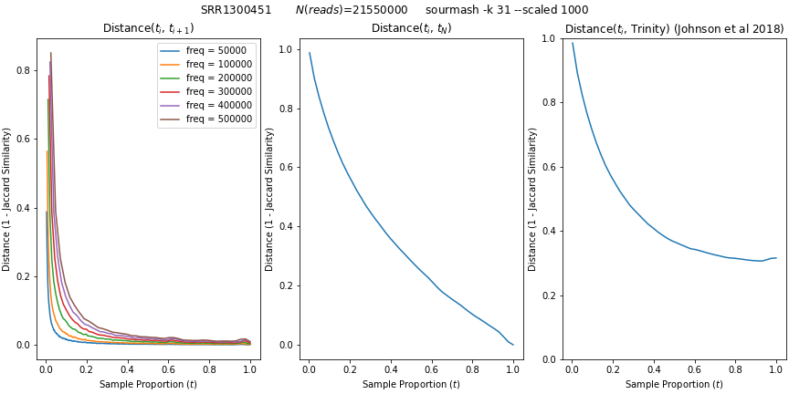
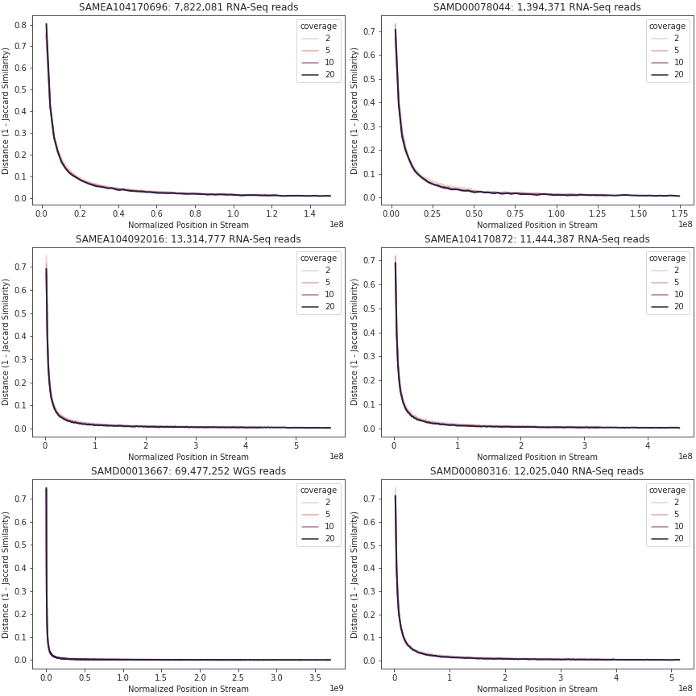

# Streaming Signature Saturation {#streaming-sketching}

<!-- This adds a different "short title" -->
\chaptermark {Signature Saturation}

\begin{sizepar}{16}{24}
\begin{description}

\item[Chapter Authors]
Camille Scott and Luiz Irber

\item[DOI]
\url{}

\end{description}
\end{sizepar}

## Introduction

Streaming de Bruijn graph compaction opens new avenues for exploring assembly graph architecture. 
In particular, we can directly explore architecture as a function of coverage by tracking changes to the graph over time.

## Methods {#chap2-methods}

### Streaming Sketches

### The Draff Sketch

## Results

### Rolling Signature Distances Display Saturation Behavior

```{r fig-chap2-sketch-saturation, results="asis", echo=FALSE, fig.cap="(ref:fig-chap2-sketch-saturation)", fig.align="center", out.width="100%"}

```

(ref:fig-chap2-sketch-saturation) **Sketching distance curves showing saturation of a transcriptomic sample.**
Sourmash FracMinHash sketch at scaled=1000, $K$=31, computed on a 21.5 million read transcriptomic sample. *Left*: Jaccard similarity between successive sketches, computed at varying sampling intervals. *Middle*: Jaccard distances between sketches at given time intervals and the final sketch. *Right*: Jaccard distances between sketches at given time intervals and the downstream sequences as assembled with Trinity in [@doi:10.1093/gigascience/giy158].

### The Draff Sketch Shows Improved Saturation Behavior over MinHash

```{r fig-chap2-sourmash-diginorm, results="asis", echo=FALSE, fig.cap="(ref:fig-chap2-sourmash-diginorm)", fig.align="center", out.height="6in"}

```

(ref:fig-chap2-sourmash-diginorm) **Streaming Jaccard Similarity of digitally-normalized sourmash-MinHash signatures.**
MinHash sketches computed with `sourmash` using $K=31$ and $N=25000$. Distances are Jaccard similarity between successive sketches, computed at an interval of 2000000 $k$-mers. Digital normalization is used as a pre-filter to the sketch stream, with each curve representing a difference coverage cutoff $C$. *Top*: A small transcriptomic sample; *Bottom*: A moderately-size whole genome sample.

```{r fig-chap2-draff-basic, results="asis", echo=FALSE, fig.cap="(ref:fig-chap2-draff-basic)", fig.align="center", out.height="6in", out.width="100%"}
include_graphics("figure/chap2/draff-rolling-wgs-txome.png")
```

(ref:fig-chap2-draff-basic) **Streaming $log$-Bray Curtis distance of `draff` sketches.**
Draff sketches computed with $W=31$, $K=9$. On the y-axis, $log$-Bray Curtis distance calculated between successive sketches; on the x-axis, normalized time in number of $k$-mers. Curves represent sketches sampled at varying $k$-mer intervals.

### The Draff Sketch Enables Novel Dimensional Analyses of Assembly Graphs

```{r fig-chap2-draff-pca, results="asis", echo=FALSE, fig.cap="(ref:fig-chap2-draff-pca)", fig.align="center", out.width="100%"}
include_graphics("figure/chap2/draff-windowed-pca.png")
```

(ref:fig-chap2-draff-pca) **Top-two principle components of sliding window over streaming draff sketches.**
Rather than computing distance metrics between successive pairs of sketches, Principle Component Analysis was run over a sliding window of 10 sketches at a time and explained variance of the top two components extracted. Each point is a PCA window proceeding through the sample.
