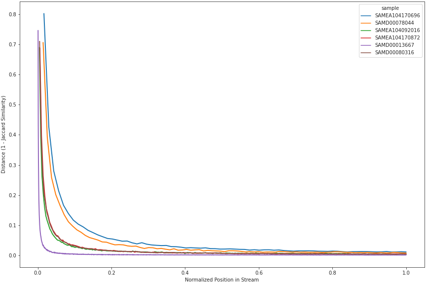
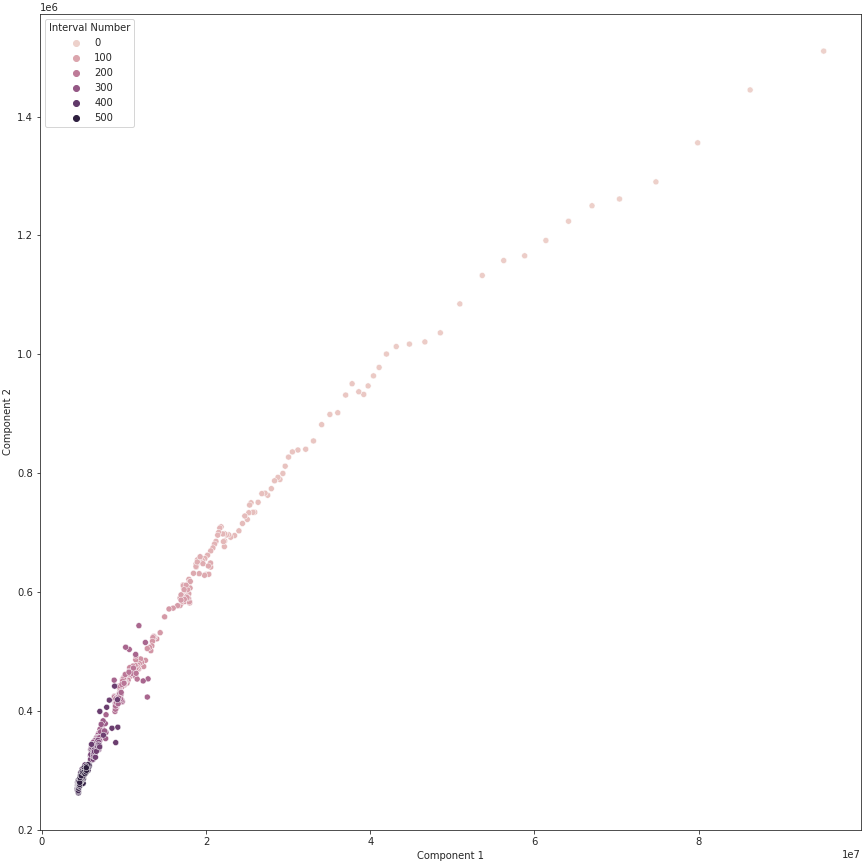

# Streaming Signature Saturation {#streaming-sketching}

<!-- This adds a different "short title" -->
\chaptermark {Signature Saturation}

\begin{sizepar}{16}{24}
\begin{description}

\item[Chapter Authors]
Camille Scott and Luiz Irber

\item[DOI]
\url{}

\end{description}
\end{sizepar}

## Introduction

In the previous chapter, we showed that streaming de Bruijn graph compaction opens new avenues for exploring assembly graph architecture. 
In particular, we can directly explore architecture as a function of coverage by tracking changes to the graph over time.
Many metrics tend toward stability as more sequence is consumed, suggesting an avenue for sub-linear approaches.
Sub-linear algorithms are those which produce a result without examining an entire data stream.
Such algorithms, in general, are concerned with *property testing*: producing a yes or no answer as to whether input data satisfies some constraint [@doi:10.1137/100791075].
For most such problems, an exact solution is clearly impossible in sub-linear time; however, with fields where data generation outpaces data analysis, quickly producing approximate solutions can be preferable to slowly producing exact solutions.
The "data deluge" of genomics has made the field a prime candidate for approximate and probabilistic approaches, with many such methods developed and improved upon in recent years [@doi:10.1146/annurev-biodatasci-072018-021156; @doi:10.1186/s13059-019-1809-x].
Sketching approaches, especially those built on MinHash, have received considerable attention for the ability to efficiently classify and cluster many large samples in low memory.

In this work, we perform a preliminary exploration of sketching for intra-sample comparison.
We focus on the stability of sketches during the data stream, where refer to high stability as saturation.
The authors of Mash point out the potential of comparing a stream to a known database and terminating after meeting a classification threshold [@doi:10.1186/s13059-016-0997-x].
Here, we explore the potential of comparing a series of sketches of a stream to themselves during construction.
Our expectation is to observe saturation behavior in these streams, opening the door for a sub-linear method without the need for a reference database.
We implement a set of tools for streaming sketch analysis in the `goetia` software [@url:https://github.com/camillescott/goetia] and demonstrate its use with MinHash and FracMinHash sketches, and with a novel type of sketch tailored to saturation detection we refer to as the Draff sketch.

## Methods {#chap2-methods}

### The Draff Sketch

The `draff` sketch is, in brief, a fixed-length vector where each position corresponds to the number of unique $W$-mers from a sequence sample that map to a $k$-mer in a Universal $k$-mer hitting set $UHS(W,k)$.
The universal $k$-mer hitting set (UHS) is a set of $k$-mers from an alphabet $\Sigma$ where any possible sequence of length $W$ over $\Sigma$ must contain a $k$-mer from the set [@doi:10.1371/journal.pcbi.1005777].
Universal $k$-mer hitting sets are an improvement over classic minimizer schemes, in that they are pre-computed and hence fixed-length any set of input sequences, and that they are smaller than minimizer schemes over the same $W$ and $k$.
The `draff` sketch takes advantage of this fixed-length property to produce compressed representations that are comparable between samples.
Each $k$-mer in the set is assigned a position in the sketch vector and a storage backend; the backend can be any $k$-kmer data structure that can count unique members, with our reference implementation supporting exact sets, Bloom filters, and HyperLogLog [@doi:10.46298/dmtcs.3545] counters.
For each sequence $s_t$ in the sequence stream $S$, each $W$-mer from $s_t$ is assigned to a $k$-mer from the hitting set, with the $k$-mer with the smallest hash value being chosen if there is mere than one.
The $W$-mer is then added to the counting backend associated with the assigned $k$-mer.
The sketch vector is computed by querying the number of unique $W$-mers associated with each $k$-mer in the UHS.

The size of the sketch depends on the parameters $W$ and $k$.
Sketches built from a larger underlying UHS (which will be those with larger values of $k$) will have a higher resolution; that is, were theoretical hitting sets be developed with values up to $W = k$, the resulting sketch would converge to a bit vector with length equal to $\|\Sigma\|^W$, or in other words, a position for every $W$-mer.
Practical values of $k$ for which we have precomputed hitting sets are $k = \{7,8,9,10\}$ with $W$ values up to 200.

$W$-mers and $k$-mers are hashed simultaneously using a rolling hash scheme [@lemire2010recursive].
To efficiently track the minimum $k$-mer for determining a hitting $k$-mer, we use an ascending minima scheme [@url:https://people.cs.uct.ac.za/~ksmith/articles/sliding_window_minimum.html].
When using full set backends such as the Bloom filter or exact sets, the data structure is inherently a partitioned de Bruijn Graph; this partitioning scheme also allows for straightforward multithreading support.

### `sourmash` MinHash Sketches

For comparison, we make use of the MinHash sketch for genomics [@doi:10.1186/s13059-016-0997-x] as implemented in the `sourmash` package [@doi:10.21105/joss.00027], as well as the FracMinHash sketch further built on in `sourmash` [@doi:10.1101/2022.01.11.475838].
MinHash sketching is related to shingling and minimizer schemes.
For some sketch size $N$, length $k$, and random hash function $f$, the $k$-mers from sequences $s_t \in S$ of a sequence stream are hashed with $f$ and the $N$ hashes with lowest value kept; hence, these methods are sometimes referred to as bottom sketches.
The resulting set of size $N$ is the MinHash sketch, and sketches can be compared to each other with the Jaccard similarity methods.
The closely related FracMinHash extends MinHash to non-fixed sizes.
Instead of keeping the bottom $N$ hashes, a cutoff hash value proportional to the size of the hash space is chosen, and all hash values less than this cutoff are kept.
Thus, the FracMinHash grows in proportion to the input data, and represents a random sample of $k$-mers with probability of the cutoff value divided by the maximum hash value.
While this means FracMinHashes have unbounded growth, it also allows implementation of additional operations such as containment queries.

### Timing and Distance Metrics {#chap2-methods-timing}

As our methods rely on measuring changes in our underlying sketches throughout a stream, robustly determining when and how to make these measurements is fundamental.
The fundamental unit of time in our framework is the observed $k$-mer: time $t$ is incremented for each $k$-mer in the stream.
As such, a single sequence fragment $s$ covers an $\texttt{len}(s) - K + 1$-length time window in the stream.
Using $k$-mers instead of sequences makes time deltas comparable between samples with different sequence lengths and input sequences over varying size, for example, those that have been subjected to quality or abundance trimming.
Timing of distance measurements and windowed operations is performed at a parameterized frequency interval $I$.
The time $t$ is compared to the previous recorded time $t_p$; when $t - t_p \geq I$, the queued measurement operations are performed and $t_p$ is set to $t$.
The implementation of this system is done at the parsing level.
When a new sequence $s_i \in S$ is parsed, and its $k$-mers consumed by the underlying analyzer (sketch, dBG, filter, compactor, or otherwise), $t$ is incremented by $\texttt{len}(s) - K + 1$ and the prior comparison made.
If $I$ is exceeded, parsing yields to metrics operations.
In this system, the actual length of measurement deltas will differ from $I$ by some positive value $\epsilon$; however,
$I \gg L$, generally exceeding $500,000$, so $\varepsilon$ is trivial.
Excepting a small $\varepsilon$ allows sequence consumers to benefit from the entire connected path of $k$-mers from a fragment $s$ when necessary.

Let the time points corresponding to these intervals be referred to as $i_0 \ldots i_j \ldots i_N$, where $N$ is the $k$-mer time length of the stream, and the sketch associated with these time points as $A_0 \ldots A_j \ldots A_N$.
During streaming sketching, the distance functions $\delta ( A_j, A_{j+1} )$ are called between sketches at successive intervals, and the result $d_j$ added to the distance list $\Delta = \{ d_0 \ldots d_j \ldots d_{N-1} \}$.
When our sketch is a `sourmash` Min-hash sketch, $\delta$ is $1 - Jaccard$, where $Jaccard$ is the Jaccard similarity.
For the `draff` sketch, $\delta$ can be any standard distance function: we commonly use the euclidean, cosine, correlation, and Canberra [@doi:10.1093/comjnl/9.1.60] distances.

## Results

### Rolling Signature Distances Display Saturation Behavior

Fig. \@ref(fig:fig-chap2-sketch-saturation) demonstrates saturation behavior of FracMinHash sketches on a transcriptomic sample taken from the MMETSP project [@doi:10.1371/journal.pbio.1001889; @doi:10.1093/gigascience/giy158].
The y-axis shows the Jaccard distances $d_j$ between the sketches at measurement intervals $i_j$ and $i_{j-1}$.
Each line represents a different measurement interval length $I$, that is, successively lower measurement frequencies.
Clearly, successive comparisons require normalization by sampling interval; expected distance between successive sketches is necessarily conditioned on the size of the underlying set of sequences (transcripts or chromosomes) and the error rate of the sequence instrument.
For all sampling intervals, the successive distances (similarities) converge toward $1$: the further into the stream, the more new $k$-mers within a sampling window are dominated by sequencing error.
The middle plot compares each the sketch at each time point $i_j$ to the final sketch at point $t_N$.
Here, we hope to see the distance curve climb steeply, then become more linear upon saturation; that is, its derivative should become constant.
In the rightmost plot, to help remove the effects of erroneous $k$-mers, we instead compare to a sketch built from an assembled and processed transcriptome from the sample.
Here, the curve much more dramatically flattens, but does not approach $1$.
Visually, we can see that the transition occurs at a similar point in the stream as in the middle plot, which lends support to our saturation hypothesis.

```{r fig-chap2-sketch-saturation, results="asis", echo=FALSE, fig.cap="(ref:fig-chap2-sketch-saturation)", fig.align="center", out.width="100%"}
include_graphics("figure/chap2/sketching-saturation-curve.png")
```

(ref:fig-chap2-sketch-saturation) **Sketching distance curves showing saturation of a transcriptomic sample.**
Sourmash FracMinHash sketch at scaled=1000, $K$=31, computed on a 21.5 million read transcriptomic sample. *Left*: Jaccard similarity between successive sketches, computed at varying sampling intervals. *Middle*: Jaccard distances between sketches at given time intervals and the final sketch. *Right*: Jaccard distances between sketches at given time intervals and the downstream sequences as assembled with Trinity in [@doi:10.1093/gigascience/giy158].


```{r fig-chap2-sourmash-diginorm, results="asis", echo=FALSE, fig.cap="(ref:fig-chap2-sourmash-diginorm)", fig.align="center", out.height="6in"}
include_graphics("figure/chap2/sourmash-diginorm-rolling-wgs-txome.png")
```

(ref:fig-chap2-sourmash-diginorm) **Streaming Jaccard Similarity of digitally-normalized sourmash-MinHash signatures.**
MinHash sketches computed with `sourmash` using $K=31$ and $N=25000$. Distances are $1.0$-Jaccard similarity between successive sketches, computed at an interval of 2000000 $k$-mers. Digital normalization is used as a pre-filter to the sketch stream, with each curve representing a difference coverage cutoff $C$. Higher coverage thresholds admit more sequences, causing the lower-threshold streams to saturate more slowly at a given *relative* position in the stream.


\@ref(fig:fig-chap2-sketch-saturation) showed FracMinHash sketches, which, while allowing greater sensitivity, have unbounded size.
For streams of sequence fragments, as opposed to assembled genomes, this property becomes problematic, with sketches growing to unwieldy sizes due to low-coverage and erroneous $k$-mers.
\@ref(fig:fig-chap2-sourmash-diginorm) and \ref(fig:fig-chap2-sourmash-diginorm-single) 

```{r fig-chap2-sourmash-diginorm-single, results="asis", echo=FALSE, fig.cap="(ref:fig-chap2-sourmash-diginorm-single)", fig.align="center", out.width="100%"}

```
(ref:fig-chap2-sourmash-diginorm-single) **Streaming Jaccard Similarity of sourmash-MinHash signatures.**
Distance curves of the same samples as \@ref(fig:fig-chap2-sourmash-diginorm) only showing coverage of $20$.


### The Draff Sketch Shows Improved Saturation Behavior over MinHash


```{r fig-chap2-draff-basic, results="asis", echo=FALSE, fig.cap="(ref:fig-chap2-draff-basic)", fig.align="center", out.height="6in", out.width="100%"}

```

(ref:fig-chap2-draff-basic) **Streaming $log$-Bray Curtis distance of `draff` sketches.**
Draff sketches computed with $W=31$, $K=9$. On the y-axis, $log$-Bray Curtis distance calculated between successive sketches; on the x-axis, normalized time in number of $k$-mers. Curves represent sketches sampled at varying $k$-mer intervals.

### The Draff Sketch Enables Novel Dimensional Analyses of Assembly Graphs

Because the Draff sketch is, intuitively, a compressed "snapshot" of $k$-mer space, in the form of vector of feature counts as opposed to the set of specific $k$-mer hashes in MinHash sketches, we are able use some more traditional numeric approaches with them.
In \@ref(fig:fig-chap2-draff-pca), we view the stream of sketches as a matrix with each row a draff sketch corresponding to measurement times $i_0 \ldots i_N$.
We then perform a Principle Component Analysis (PCA) along a length-10 sliding window of the rows, and extract the explained variance of the top two components for each window.
In this way, we reduce the change in the compressed "$k$-mer space" over time to a 2-dimensional representation.
This offers a different view on the saturation behavior.
Rather than distances between successive sketches decreasing and then stabilizing, we instead see the variance of a slice of sketches decreasing; moreover, a reduction in explanatory power of the top 2 components can be interpreted as the locations of new unique $k$-mers becoming more diffuse as we progress through the stream.
This provides further support for our saturation model where changes in the stream post-saturation are dominated by erroneous $k$-mers.

```{r fig-chap2-draff-pca, results="asis", echo=FALSE, fig.cap="(ref:fig-chap2-draff-pca)", fig.align="center", out.width="100%"}

```

(ref:fig-chap2-draff-pca) **Top-two principle components of sliding window over streaming draff sketches.**
Rather than computing distance metrics between successive pairs of sketches, Principle Component Analysis was run over a sliding window of 10 sketches at a time and explained variance of the top two components extracted. Each point is a PCA window proceeding through the sample.


## Discussion
